# Bank Marketing - Subscription Prediction

### Marketing
The action or business of promoting and selling products or services, including market research and advertising.

### Term deposit
Term Deposits are one of the best investment options for people who are looking for a stable and safe return on their investments. In Term Deposits, the sum of money is kept for a fixed maturity and the depositor is not allowed to withdraw this sum till the end of the maturity period. That is why they are called as Term Deposits because they are kept up to a particular term.

## Data Set information

The data is related with direct marketing campaigns of a Portuguese banking institution. 
The marketing campaigns were based on phone calls. Often, more than one contact to the same client was required, in order to access if the product (bank term deposit) would be ('yes') or not ('no') subscribed.

The dataset bank-additional-full.csv contains all examples (45211) with 17 features, ordered by date (from May 2008 to November 2010), very close to the data analyzed in [Moro et al., 2014]
### Attribute information
#### Input Variables
##### Bank Client Data
**age:** (numeric)  
**job:** type of job (categorical: 'admin.','blue-collar','entrepreneur','housemaid','management','retired','self-employed','services','student','technician','unemployed','unknown')  
**marital:** marital status (categorical: 'divorced','married','single','unknown'; note: 'divorced' means divorced or widowed)  
**education:** (categorical: primary, secondary, tertiary and unknown)  
**default:** has credit in default? (categorical: 'no','yes')  
**balance:** average yearly balance, in euros (numeric)   
**housing:** has housing loan? (categorical: 'no','yes')  
**loan:** has personal loan? (categorical: 'no','yes')  
##### Related with the last contact of the current campaign:
**contact:** contact communication type (categorical: 'cellular','telephone')  
**day:** last contact day of the month (numeric)  
**month:** last contact month of year (categorical: 'jan', 'feb', 'mar', ..., 'nov', 'dec')  
**duration:** last contact duration, in seconds (numeric). Important note: this attribute highly affects the output target (e.g., if duration=0 then y='no'). Yet, the duration is not known before a call is performed. Also, after the end of the call y is obviously known.
##### Other attributes:
**campaign:** number of contacts performed during this campaign and for this client (numeric, includes last contact)  
**pdays:** number of days that passed by after the client was last contacted from a previous campaign (numeric; -1 means client was not previously contacted)  
**previous:** number of contacts performed before this campaign and for this client (numeric)  
**poutcome:** outcome of the previous marketing campaign (categorical: 'failure','nonexistent','success')  

#### Output variable (desired target):
**y:** has the client subscribed a term deposit? (binary: 'yes','no')

**Note:** It is mentioned in the Data Set information that thee are no missing values, but still we will run some test forr the same.

## Data Exploration
### import pandas and numpy for Data Analysis


```python
import pandas as pd
import numpy as np
import matplotlib.pyplot as plt
import seaborn as sns
import warnings

warnings.filterwarnings('ignore')
%matplotlib inline 

df = pd.read_csv('./bank/bank-full.csv')
print('Total samples: ', len(df))
```

    Total samples:  45211
    

### Missing Data


```python
sns.heatmap(df.isnull(),yticklabels=False,cbar=False,cmap='viridis')
plt.show()
```


    
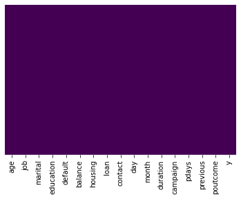
    


There are no null values.

### Overview of available data


```python
df.describe()
# df[df['pdays'] != -1].count()
# df[df['previous'] != 0].count()
```


<div>
<style scoped>
    .dataframe tbody tr th:only-of-type {
        vertical-align: middle;
    }

    .dataframe tbody tr th {
        vertical-align: top;
    }

    .dataframe thead th {
        text-align: right;
    }
</style>
<table border="1" class="dataframe">
  <thead>
    <tr style="text-align: right;">
      <th></th>
      <th>age</th>
      <th>balance</th>
      <th>day</th>
      <th>duration</th>
      <th>campaign</th>
      <th>pdays</th>
      <th>previous</th>
    </tr>
  </thead>
  <tbody>
    <tr>
      <th>count</th>
      <td>45211.000000</td>
      <td>45211.000000</td>
      <td>45211.000000</td>
      <td>45211.000000</td>
      <td>45211.000000</td>
      <td>45211.000000</td>
      <td>45211.000000</td>
    </tr>
    <tr>
      <th>mean</th>
      <td>40.936210</td>
      <td>1362.272058</td>
      <td>15.806419</td>
      <td>258.163080</td>
      <td>2.763841</td>
      <td>40.197828</td>
      <td>0.580323</td>
    </tr>
    <tr>
      <th>std</th>
      <td>10.618762</td>
      <td>3044.765829</td>
      <td>8.322476</td>
      <td>257.527812</td>
      <td>3.098021</td>
      <td>100.128746</td>
      <td>2.303441</td>
    </tr>
    <tr>
      <th>min</th>
      <td>18.000000</td>
      <td>-8019.000000</td>
      <td>1.000000</td>
      <td>0.000000</td>
      <td>1.000000</td>
      <td>-1.000000</td>
      <td>0.000000</td>
    </tr>
    <tr>
      <th>25%</th>
      <td>33.000000</td>
      <td>72.000000</td>
      <td>8.000000</td>
      <td>103.000000</td>
      <td>1.000000</td>
      <td>-1.000000</td>
      <td>0.000000</td>
    </tr>
    <tr>
      <th>50%</th>
      <td>39.000000</td>
      <td>448.000000</td>
      <td>16.000000</td>
      <td>180.000000</td>
      <td>2.000000</td>
      <td>-1.000000</td>
      <td>0.000000</td>
    </tr>
    <tr>
      <th>75%</th>
      <td>48.000000</td>
      <td>1428.000000</td>
      <td>21.000000</td>
      <td>319.000000</td>
      <td>3.000000</td>
      <td>-1.000000</td>
      <td>0.000000</td>
    </tr>
    <tr>
      <th>max</th>
      <td>95.000000</td>
      <td>102127.000000</td>
      <td>31.000000</td>
      <td>4918.000000</td>
      <td>63.000000</td>
      <td>871.000000</td>
      <td>275.000000</td>
    </tr>
  </tbody>
</table>
</div>


#### Quick Observations on Numerical Data
- Total available data count is 45211 entries  
- Mean Age of the contacted customers is 41 years (Approx)  
- Mininmum Age of the contacted customers is 18 years
- Maximum Age of the contacted customers is 95 years
- Mean of call durationss is 258 seconds  
- Mean account balance for the customers 1362 euros  
- More than 75% of the the values in the column 'pdays' are set to -1. We know from our attribute informations that -1 means client was not previously contacted
- Just similar to the last observation more than 75% of the values inside the columns 'previous' which indicates how many times the customer was contacted before this campaign is 0 i. e. the customer is being contactedd forr the very first time.
- The values '-1' and '0' of the columns 'pdays' and 'previous' respectively are actually pointing towards the same fact.
- Because of the significant redundency of '0' and '-1' in their respective columns We might drop them later if their fluctuations do not show any relation with the outcome i. e. column 'y'.


```python
df.describe(include='object')
```


<div>
<style scoped>
    .dataframe tbody tr th:only-of-type {
        vertical-align: middle;
    }

    .dataframe tbody tr th {
        vertical-align: top;
    }

    .dataframe thead th {
        text-align: right;
    }
</style>
<table border="1" class="dataframe">
  <thead>
    <tr style="text-align: right;">
      <th></th>
      <th>job</th>
      <th>marital</th>
      <th>education</th>
      <th>default</th>
      <th>housing</th>
      <th>loan</th>
      <th>contact</th>
      <th>month</th>
      <th>poutcome</th>
      <th>y</th>
    </tr>
  </thead>
  <tbody>
    <tr>
      <th>count</th>
      <td>45211</td>
      <td>45211</td>
      <td>45211</td>
      <td>45211</td>
      <td>45211</td>
      <td>45211</td>
      <td>45211</td>
      <td>45211</td>
      <td>45211</td>
      <td>45211</td>
    </tr>
    <tr>
      <th>unique</th>
      <td>12</td>
      <td>3</td>
      <td>4</td>
      <td>2</td>
      <td>2</td>
      <td>2</td>
      <td>3</td>
      <td>12</td>
      <td>4</td>
      <td>2</td>
    </tr>
    <tr>
      <th>top</th>
      <td>blue-collar</td>
      <td>married</td>
      <td>secondary</td>
      <td>no</td>
      <td>yes</td>
      <td>no</td>
      <td>cellular</td>
      <td>may</td>
      <td>unknown</td>
      <td>no</td>
    </tr>
    <tr>
      <th>freq</th>
      <td>9732</td>
      <td>27214</td>
      <td>23202</td>
      <td>44396</td>
      <td>25130</td>
      <td>37967</td>
      <td>29285</td>
      <td>13766</td>
      <td>36959</td>
      <td>39922</td>
    </tr>
  </tbody>
</table>
</div>


#### Quick Observation on Categorical Data
- Out of 45211, more than 44000 i. e. 97.3% customers do not have a credit. The number of customers with credit are negligible when compared to it. We might drop this column later.


```python
df.info()
```

    <class 'pandas.core.frame.DataFrame'>
    RangeIndex: 45211 entries, 0 to 45210
    Data columns (total 17 columns):
     #   Column     Non-Null Count  Dtype 
    ---  ------     --------------  ----- 
     0   age        45211 non-null  int64 
     1   job        45211 non-null  object
     2   marital    45211 non-null  object
     3   education  45211 non-null  object
     4   default    45211 non-null  object
     5   balance    45211 non-null  int64 
     6   housing    45211 non-null  object
     7   loan       45211 non-null  object
     8   contact    45211 non-null  object
     9   day        45211 non-null  int64 
     10  month      45211 non-null  object
     11  duration   45211 non-null  int64 
     12  campaign   45211 non-null  int64 
     13  pdays      45211 non-null  int64 
     14  previous   45211 non-null  int64 
     15  poutcome   45211 non-null  object
     16  y          45211 non-null  object
    dtypes: int64(7), object(10)
    memory usage: 5.9+ MB
    


```python
df.head(10)
```


<div>
<style scoped>
    .dataframe tbody tr th:only-of-type {
        vertical-align: middle;
    }

    .dataframe tbody tr th {
        vertical-align: top;
    }

    .dataframe thead th {
        text-align: right;
    }
</style>
<table border="1" class="dataframe">
  <thead>
    <tr style="text-align: right;">
      <th></th>
      <th>age</th>
      <th>job</th>
      <th>marital</th>
      <th>education</th>
      <th>default</th>
      <th>balance</th>
      <th>housing</th>
      <th>loan</th>
      <th>contact</th>
      <th>day</th>
      <th>month</th>
      <th>duration</th>
      <th>campaign</th>
      <th>pdays</th>
      <th>previous</th>
      <th>poutcome</th>
      <th>y</th>
    </tr>
  </thead>
  <tbody>
    <tr>
      <th>0</th>
      <td>58</td>
      <td>management</td>
      <td>married</td>
      <td>tertiary</td>
      <td>no</td>
      <td>2143</td>
      <td>yes</td>
      <td>no</td>
      <td>unknown</td>
      <td>5</td>
      <td>may</td>
      <td>261</td>
      <td>1</td>
      <td>-1</td>
      <td>0</td>
      <td>unknown</td>
      <td>no</td>
    </tr>
    <tr>
      <th>1</th>
      <td>44</td>
      <td>technician</td>
      <td>single</td>
      <td>secondary</td>
      <td>no</td>
      <td>29</td>
      <td>yes</td>
      <td>no</td>
      <td>unknown</td>
      <td>5</td>
      <td>may</td>
      <td>151</td>
      <td>1</td>
      <td>-1</td>
      <td>0</td>
      <td>unknown</td>
      <td>no</td>
    </tr>
    <tr>
      <th>2</th>
      <td>33</td>
      <td>entrepreneur</td>
      <td>married</td>
      <td>secondary</td>
      <td>no</td>
      <td>2</td>
      <td>yes</td>
      <td>yes</td>
      <td>unknown</td>
      <td>5</td>
      <td>may</td>
      <td>76</td>
      <td>1</td>
      <td>-1</td>
      <td>0</td>
      <td>unknown</td>
      <td>no</td>
    </tr>
    <tr>
      <th>3</th>
      <td>47</td>
      <td>blue-collar</td>
      <td>married</td>
      <td>unknown</td>
      <td>no</td>
      <td>1506</td>
      <td>yes</td>
      <td>no</td>
      <td>unknown</td>
      <td>5</td>
      <td>may</td>
      <td>92</td>
      <td>1</td>
      <td>-1</td>
      <td>0</td>
      <td>unknown</td>
      <td>no</td>
    </tr>
    <tr>
      <th>4</th>
      <td>33</td>
      <td>unknown</td>
      <td>single</td>
      <td>unknown</td>
      <td>no</td>
      <td>1</td>
      <td>no</td>
      <td>no</td>
      <td>unknown</td>
      <td>5</td>
      <td>may</td>
      <td>198</td>
      <td>1</td>
      <td>-1</td>
      <td>0</td>
      <td>unknown</td>
      <td>no</td>
    </tr>
    <tr>
      <th>5</th>
      <td>35</td>
      <td>management</td>
      <td>married</td>
      <td>tertiary</td>
      <td>no</td>
      <td>231</td>
      <td>yes</td>
      <td>no</td>
      <td>unknown</td>
      <td>5</td>
      <td>may</td>
      <td>139</td>
      <td>1</td>
      <td>-1</td>
      <td>0</td>
      <td>unknown</td>
      <td>no</td>
    </tr>
    <tr>
      <th>6</th>
      <td>28</td>
      <td>management</td>
      <td>single</td>
      <td>tertiary</td>
      <td>no</td>
      <td>447</td>
      <td>yes</td>
      <td>yes</td>
      <td>unknown</td>
      <td>5</td>
      <td>may</td>
      <td>217</td>
      <td>1</td>
      <td>-1</td>
      <td>0</td>
      <td>unknown</td>
      <td>no</td>
    </tr>
    <tr>
      <th>7</th>
      <td>42</td>
      <td>entrepreneur</td>
      <td>divorced</td>
      <td>tertiary</td>
      <td>yes</td>
      <td>2</td>
      <td>yes</td>
      <td>no</td>
      <td>unknown</td>
      <td>5</td>
      <td>may</td>
      <td>380</td>
      <td>1</td>
      <td>-1</td>
      <td>0</td>
      <td>unknown</td>
      <td>no</td>
    </tr>
    <tr>
      <th>8</th>
      <td>58</td>
      <td>retired</td>
      <td>married</td>
      <td>primary</td>
      <td>no</td>
      <td>121</td>
      <td>yes</td>
      <td>no</td>
      <td>unknown</td>
      <td>5</td>
      <td>may</td>
      <td>50</td>
      <td>1</td>
      <td>-1</td>
      <td>0</td>
      <td>unknown</td>
      <td>no</td>
    </tr>
    <tr>
      <th>9</th>
      <td>43</td>
      <td>technician</td>
      <td>single</td>
      <td>secondary</td>
      <td>no</td>
      <td>593</td>
      <td>yes</td>
      <td>no</td>
      <td>unknown</td>
      <td>5</td>
      <td>may</td>
      <td>55</td>
      <td>1</td>
      <td>-1</td>
      <td>0</td>
      <td>unknown</td>
      <td>no</td>
    </tr>
  </tbody>
</table>
</div>


```python
df.keys()
```


    Index(['age', 'job', 'marital', 'education', 'default', 'balance', 'housing',
           'loan', 'contact', 'day', 'month', 'duration', 'campaign', 'pdays',
           'previous', 'poutcome', 'y'],
          dtype='object')


```python
df.shape
```


    (45211, 17)


```python
df.groupby('y').size()
```


    y
    no     39922
    yes     5289
    dtype: int64


**Quick Observation** 
- 5289 Out of 45211 contacted customers subscribed


```python
# Adding a new column by name 'subscribed' to store the value '1' if subscribed, else '0' 
subscribed = len(df[df.y == 'yes'])
```


```python
df.keys()
```


    Index(['age', 'job', 'marital', 'education', 'default', 'balance', 'housing',
           'loan', 'contact', 'day', 'month', 'duration', 'campaign', 'pdays',
           'previous', 'poutcome', 'y'],
          dtype='object')


```python
# By calculating the prevalance we are checking that out of total customers how many customer have actually suscribed 
def calculate_prevalance(subscribed):
    total_customers = len(df)
    positive_prevalance = subscribed/total_customers
    positive_prevalance = round(positive_prevalance, 3)
    print(f"The positive prevalnce is: {positive_prevalance}")
    
calculate_prevalance(subscribed)
```

    The positive prevalnce is: 0.117
    

### Exploring unique values

- Checking if there are any unnecessary columns
- Finding categorical varieties


```python
df[list(df.columns)[:10]].head()
```


<div>
<style scoped>
    .dataframe tbody tr th:only-of-type {
        vertical-align: middle;
    }

    .dataframe tbody tr th {
        vertical-align: top;
    }

    .dataframe thead th {
        text-align: right;
    }
</style>
<table border="1" class="dataframe">
  <thead>
    <tr style="text-align: right;">
      <th></th>
      <th>age</th>
      <th>job</th>
      <th>marital</th>
      <th>education</th>
      <th>default</th>
      <th>balance</th>
      <th>housing</th>
      <th>loan</th>
      <th>contact</th>
      <th>day</th>
    </tr>
  </thead>
  <tbody>
    <tr>
      <th>0</th>
      <td>58</td>
      <td>management</td>
      <td>married</td>
      <td>tertiary</td>
      <td>no</td>
      <td>2143</td>
      <td>yes</td>
      <td>no</td>
      <td>unknown</td>
      <td>5</td>
    </tr>
    <tr>
      <th>1</th>
      <td>44</td>
      <td>technician</td>
      <td>single</td>
      <td>secondary</td>
      <td>no</td>
      <td>29</td>
      <td>yes</td>
      <td>no</td>
      <td>unknown</td>
      <td>5</td>
    </tr>
    <tr>
      <th>2</th>
      <td>33</td>
      <td>entrepreneur</td>
      <td>married</td>
      <td>secondary</td>
      <td>no</td>
      <td>2</td>
      <td>yes</td>
      <td>yes</td>
      <td>unknown</td>
      <td>5</td>
    </tr>
    <tr>
      <th>3</th>
      <td>47</td>
      <td>blue-collar</td>
      <td>married</td>
      <td>unknown</td>
      <td>no</td>
      <td>1506</td>
      <td>yes</td>
      <td>no</td>
      <td>unknown</td>
      <td>5</td>
    </tr>
    <tr>
      <th>4</th>
      <td>33</td>
      <td>unknown</td>
      <td>single</td>
      <td>unknown</td>
      <td>no</td>
      <td>1</td>
      <td>no</td>
      <td>no</td>
      <td>unknown</td>
      <td>5</td>
    </tr>
  </tbody>
</table>
</div>


```python
df[list(df.columns)[10:]].head()
```


<div>
<style scoped>
    .dataframe tbody tr th:only-of-type {
        vertical-align: middle;
    }

    .dataframe tbody tr th {
        vertical-align: top;
    }

    .dataframe thead th {
        text-align: right;
    }
</style>
<table border="1" class="dataframe">
  <thead>
    <tr style="text-align: right;">
      <th></th>
      <th>month</th>
      <th>duration</th>
      <th>campaign</th>
      <th>pdays</th>
      <th>previous</th>
      <th>poutcome</th>
      <th>y</th>
    </tr>
  </thead>
  <tbody>
    <tr>
      <th>0</th>
      <td>may</td>
      <td>261</td>
      <td>1</td>
      <td>-1</td>
      <td>0</td>
      <td>unknown</td>
      <td>no</td>
    </tr>
    <tr>
      <th>1</th>
      <td>may</td>
      <td>151</td>
      <td>1</td>
      <td>-1</td>
      <td>0</td>
      <td>unknown</td>
      <td>no</td>
    </tr>
    <tr>
      <th>2</th>
      <td>may</td>
      <td>76</td>
      <td>1</td>
      <td>-1</td>
      <td>0</td>
      <td>unknown</td>
      <td>no</td>
    </tr>
    <tr>
      <th>3</th>
      <td>may</td>
      <td>92</td>
      <td>1</td>
      <td>-1</td>
      <td>0</td>
      <td>unknown</td>
      <td>no</td>
    </tr>
    <tr>
      <th>4</th>
      <td>may</td>
      <td>198</td>
      <td>1</td>
      <td>-1</td>
      <td>0</td>
      <td>unknown</td>
      <td>no</td>
    </tr>
  </tbody>
</table>
</div>


```python
df.shape
```


    (45211, 17)


```python
# check unique values for every column
for feature in df.columns:
    
    # get a list of unique values
    unique_values = df[feature].unique()
    print(f'{feature} : {len(unique_values)} unique values')
```

    age : 77 unique values
    job : 12 unique values
    marital : 3 unique values
    education : 4 unique values
    default : 2 unique values
    balance : 7168 unique values
    housing : 2 unique values
    loan : 2 unique values
    contact : 3 unique values
    day : 31 unique values
    month : 12 unique values
    duration : 1573 unique values
    campaign : 48 unique values
    pdays : 559 unique values
    previous : 41 unique values
    poutcome : 4 unique values
    y : 2 unique values
    


```python
# for every column
check_value_occerrence = []
for feature in df.columns:
    
    # get a list of unique values
    unique_values = df[feature].unique()
    number_of_unique_values = len(unique_values)
    if number_of_unique_values < 30:
        print(f'{feature} : {number_of_unique_values}\n{unique_values}')
        check_value_occerrence.append(feature)
```

    job : 12
    ['management' 'technician' 'entrepreneur' 'blue-collar' 'unknown'
     'retired' 'admin.' 'services' 'self-employed' 'unemployed' 'housemaid'
     'student']
    marital : 3
    ['married' 'single' 'divorced']
    education : 4
    ['tertiary' 'secondary' 'unknown' 'primary']
    default : 2
    ['no' 'yes']
    housing : 2
    ['yes' 'no']
    loan : 2
    ['no' 'yes']
    contact : 3
    ['unknown' 'cellular' 'telephone']
    month : 12
    ['may' 'jun' 'jul' 'aug' 'oct' 'nov' 'dec' 'jan' 'feb' 'mar' 'apr' 'sep']
    poutcome : 4
    ['unknown' 'failure' 'other' 'success']
    y : 2
    ['no' 'yes']
    

### Numerical Features


```python
numerical_data = [data for data in df.dtypes[df.dtypes == 'int64'].index]
numerical_data
```


    ['age', 'balance', 'day', 'duration', 'campaign', 'pdays', 'previous']


```python
df[numerical_data].isnull().sum()
```


    age         0
    balance     0
    day         0
    duration    0
    campaign    0
    pdays       0
    previous    0
    dtype: int64


```python
df[numerical_data].head()
```


<div>
<style scoped>
    .dataframe tbody tr th:only-of-type {
        vertical-align: middle;
    }

    .dataframe tbody tr th {
        vertical-align: top;
    }

    .dataframe thead th {
        text-align: right;
    }
</style>
<table border="1" class="dataframe">
  <thead>
    <tr style="text-align: right;">
      <th></th>
      <th>age</th>
      <th>balance</th>
      <th>day</th>
      <th>duration</th>
      <th>campaign</th>
      <th>pdays</th>
      <th>previous</th>
    </tr>
  </thead>
  <tbody>
    <tr>
      <th>0</th>
      <td>58</td>
      <td>2143</td>
      <td>5</td>
      <td>261</td>
      <td>1</td>
      <td>-1</td>
      <td>0</td>
    </tr>
    <tr>
      <th>1</th>
      <td>44</td>
      <td>29</td>
      <td>5</td>
      <td>151</td>
      <td>1</td>
      <td>-1</td>
      <td>0</td>
    </tr>
    <tr>
      <th>2</th>
      <td>33</td>
      <td>2</td>
      <td>5</td>
      <td>76</td>
      <td>1</td>
      <td>-1</td>
      <td>0</td>
    </tr>
    <tr>
      <th>3</th>
      <td>47</td>
      <td>1506</td>
      <td>5</td>
      <td>92</td>
      <td>1</td>
      <td>-1</td>
      <td>0</td>
    </tr>
    <tr>
      <th>4</th>
      <td>33</td>
      <td>1</td>
      <td>5</td>
      <td>198</td>
      <td>1</td>
      <td>-1</td>
      <td>0</td>
    </tr>
  </tbody>
</table>
</div>


```python
#creating distribution and box plots
for col in numerical_data : 
    plt.figure(figsize=(12,4))
    
    plt.subplot(1,2,1)
    sns.distplot(df[col])
    plt.xlabel(col)
    plt.ylabel('Density')
    
    plt.subplot(1,2,2)
    sns.boxplot(x='y', y = col, data =df, showmeans = True)
    plt.xlabel('Target')
    plt.ylabel(col)
    
    plt.show()
```


    
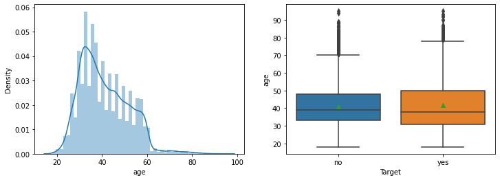
    


    
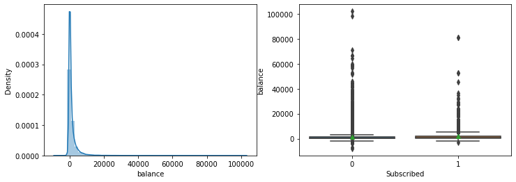
    


    

    


    
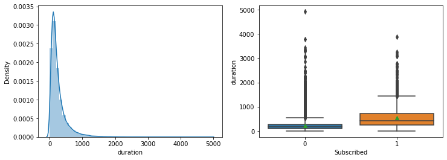
    


    
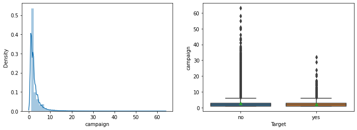
    


    

    


    
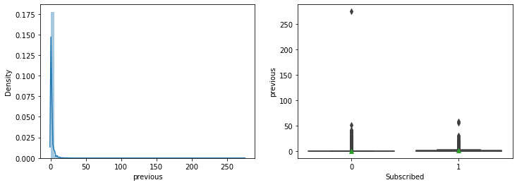
    


**Observation:** 
- From the Density and boxplot shown above we can say that the customerrs with longer call durations are more likely to subscribe for the term deposit
- Most of the customers who actually subscribed were contacted for the very first time
- Except for the column of age and days, all the other numerical features seems to be left skewed.


```python
plt.rcParams.update({'font.size': 11})
for col in numerical_data : 
    if col not in ['balance', 'duration', 'pdays']:
        plt.figure(figsize=(20,10))
        plt.subplot().patch.set_visible(False)
        sns.countplot(x = df[col], data = df)
        plt.xlabel(col.title())
        plt.ylabel('Count')

        plt.show()
```


    
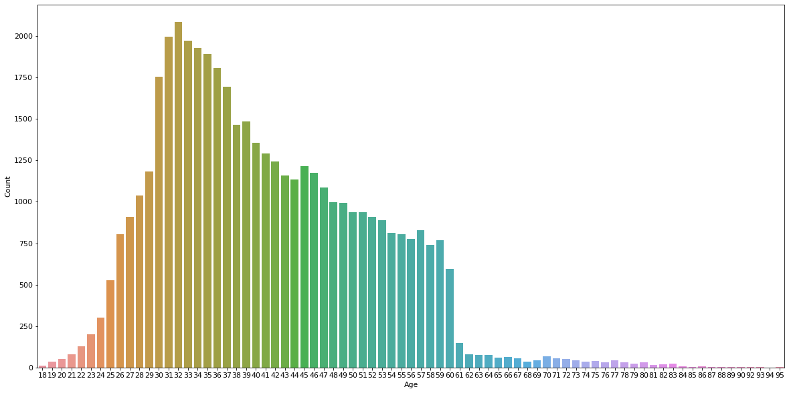
    


    

    


    
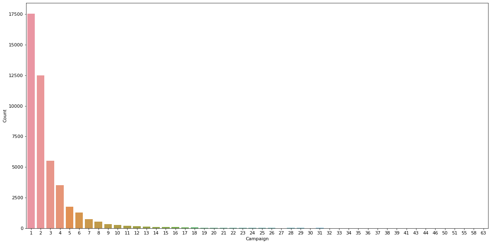
    


    
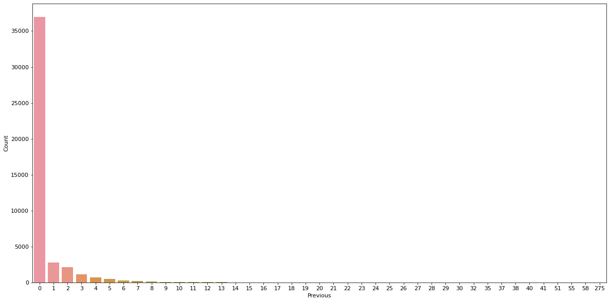
    


Balance, duration, pdays can be stored in bins


```python
balance_bins = pd.cut(df['balance'], bins=2)
duration_bins = pd.cut(df['duration'], bins=3)
pdays_bins = pd.cut(df['pdays'], bins=2)
data_bins = [balance_bins, duration_bins, pdays_bins]

bin_names = ['balance_bins', 'duration_bins', 'pdays_bins']

plt.rcParams.update({'font.size': 12})

for bin_index in range(0, len(data_bins), 2): 
    plt.figure(figsize=(16,4))
    
    index = bin_index
    bin_name = data_bins[index]
    
    plt.subplot(1, 2, 1)
    sns.countplot(x = bin_name, data = df)
    plt.xlabel(f'{bin_names[index]}')
    plt.ylabel('Count')
    index += 1
    
    if index != 3:
        bin_name = data_bins[index]
        plt.subplot(1, 2, 2)
        sns.countplot(x = bin_name, data = df)
        plt.xlabel(f'{bin_names[index]}')
        plt.ylabel('Count')

    plt.show()
```


    
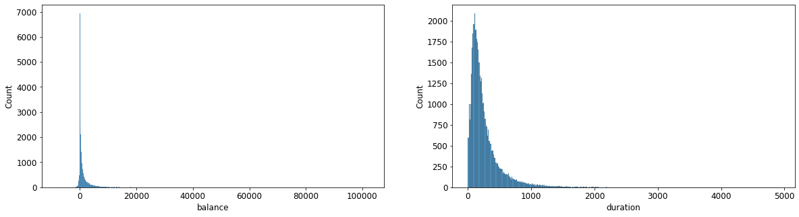
    


    
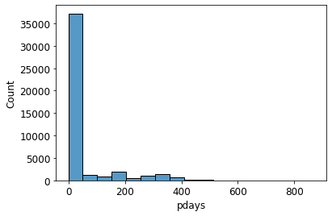
    


**Observations**
- The maximum targeted age group is 30 to 37 Years old with more than 2000 people of age 32
- More than 2500 people were contacted on 20th day of the month
- more than 17500 customers were contacted only once during the campaign

## Categorical Features

Categorical variables are non-numeric data such as job and education. To turn these non-numerical data into variables, the simplest thing is to use a technique called one-hot encoding, which will be explained below.


```python
object_data = [data for data in df.dtypes[df.dtypes == 'object'].index]
object_data
```


    ['job',
     'marital',
     'education',
     'default',
     'housing',
     'loan',
     'contact',
     'month',
     'poutcome',
     'y']


### Graphical Representation of Categorical Features


```python
plt.rcParams.update({'font.size': 11})

plt.figure(figsize=(16,4))
plt.subplot().patch.set_visible(False)
sns.countplot(x = df['job'], data = df)
plt.xlabel('Job')
plt.ylabel('Count')

plt.rcParams.update({'font.size': 16})

for col in range(1, len(object_data) - 1, 2): 
    plt.figure(figsize=(16,4))
    col_index = col
    column_name = object_data[col_index]
    col_index += 1
    plt.subplot(1, 2, 1).patch.set_visible(False)
    sns.countplot(x = df[column_name], data = df)
    plt.xlabel(column_name.title())
    plt.ylabel('Count')
                 
    plt.subplot(1, 2, 2)
    column_name = object_data[col_index]
    sns.countplot(x = df[column_name], data = df)
    plt.xlabel(column_name.title())
    plt.ylabel('Count')
    
    plt.show()
```


    

    


    
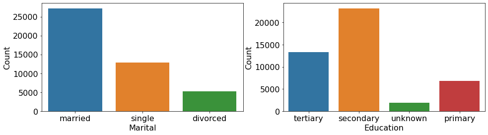
    


    
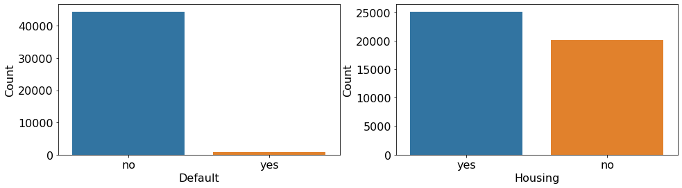
    


    
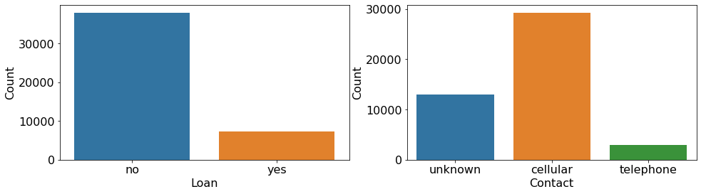
    


    
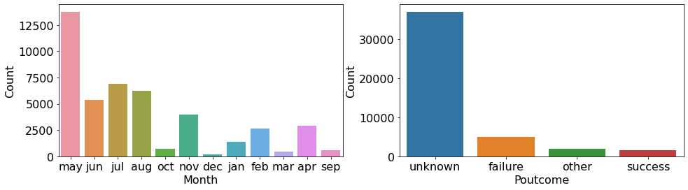
    


**Observations**
- We can see the most of the targeted customers are either in management or are blue-coller (9000+ each)
- More than 25000 of the customers are married
- 20000+ customers have received secondary education
- 40000+ customers do not have any credit
- Around 25000+ have taken a housing loan
- 35000+ People do not have any kind of personal loan
- Around 30000+ people were contacted over cellular phones
- Most of the customers were contacted in the month of May
- Most of the people are being contacted for the very first time hence most of the values in the column poutcomee are unknown
- 5289 Out of 45211 contacted customers subscribed


```python
plt.rcParams.update({'font.size': 11})

plt.figure(figsize=(16,4))
plt.subplot().patch.set_visible(False)
sns.countplot(x = df['job'], hue='y', data = df)
plt.xlabel('Job')
plt.ylabel('Count')

plt.rcParams.update({'font.size': 16})

plt.show()

for col in range(1, len(object_data) - 1, 2): 
    plt.figure(figsize=(16,4))
    col_index = col
    column_name = object_data[col_index]
    col_index += 1
    plt.subplot(1, 2, 1).patch.set_visible(False)
    sns.countplot(x=df[column_name],hue='y',data=df)
    
    column_name = object_data[col_index]
    plt.subplot(1, 2, 2).patch.set_visible(False)
    sns.countplot(x=df[column_name],hue='y',data=df)
    
    plt.show()
```


    
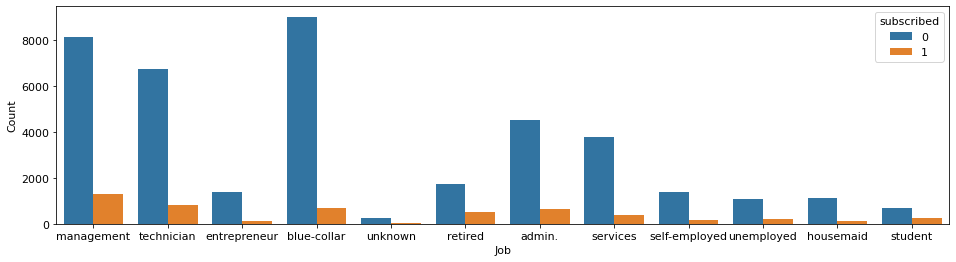
    


    

    


    
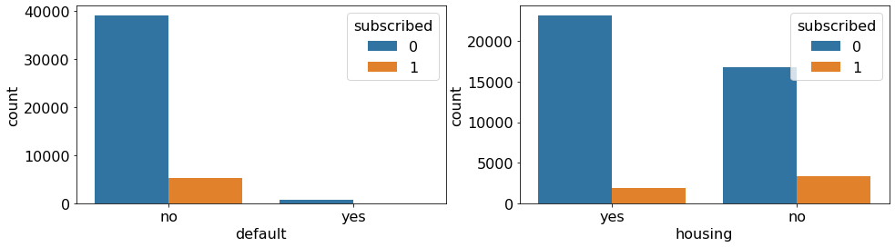
    


    
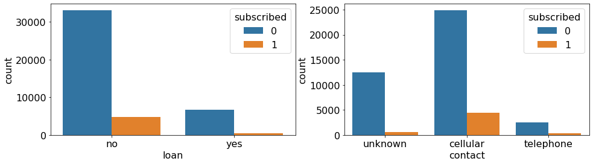
    


    
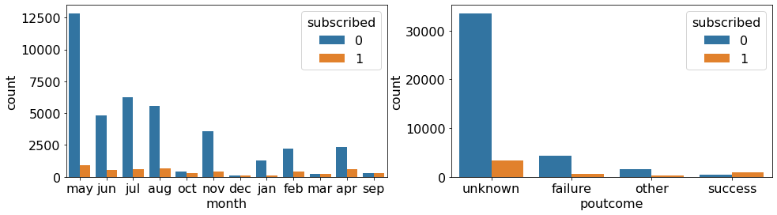
    


```python
for col in object_data:
    print(df.groupby(['y', col]).size())
```

    y    job          
    no   admin.           4540
         blue-collar      9024
         entrepreneur     1364
         housemaid        1131
         management       8157
         retired          1748
         self-employed    1392
         services         3785
         student           669
         technician       6757
         unemployed       1101
         unknown           254
    yes  admin.            631
         blue-collar       708
         entrepreneur      123
         housemaid         109
         management       1301
         retired           516
         self-employed     187
         services          369
         student           269
         technician        840
         unemployed        202
         unknown            34
    dtype: int64
    y    marital 
    no   divorced     4585
         married     24459
         single      10878
    yes  divorced      622
         married      2755
         single       1912
    dtype: int64
    y    education
    no   primary       6260
         secondary    20752
         tertiary     11305
         unknown       1605
    yes  primary        591
         secondary     2450
         tertiary      1996
         unknown        252
    dtype: int64
    y    default
    no   no         39159
         yes          763
    yes  no          5237
         yes           52
    dtype: int64
    y    housing
    no   no         16727
         yes        23195
    yes  no          3354
         yes         1935
    dtype: int64
    y    loan
    no   no      33162
         yes      6760
    yes  no       4805
         yes       484
    dtype: int64
    y    contact  
    no   cellular     24916
         telephone     2516
         unknown      12490
    yes  cellular      4369
         telephone      390
         unknown        530
    dtype: int64
    y    month
    no   apr       2355
         aug       5559
         dec        114
         feb       2208
         jan       1261
         jul       6268
         jun       4795
         mar        229
         may      12841
         nov       3567
         oct        415
         sep        310
    yes  apr        577
         aug        688
         dec        100
         feb        441
         jan        142
         jul        627
         jun        546
         mar        248
         may        925
         nov        403
         oct        323
         sep        269
    dtype: int64
    y    poutcome
    no   failure      4283
         other        1533
         success       533
         unknown     33573
    yes  failure       618
         other         307
         success       978
         unknown      3386
    dtype: int64
    y    y  
    no   no     39922
    yes  yes     5289
    dtype: int64
    

**Obeservations**
- The customerrs in job category 'retired' have shown higher interest in the term deposit as compared to the others.
- Customers with a tertiary level of education were more like to subscribe for the term deposit.
- The people who do not have a credit have shown interest in the term deposit.
- The people who do not have a housing loan have shown relatively higher interest in the term deposit.
- Customers who were contacted during the month of March, September, December, and October repectively have mostly subscribed to the term deposit.


```python
df.corr()
```


<div>
<style scoped>
    .dataframe tbody tr th:only-of-type {
        vertical-align: middle;
    }

    .dataframe tbody tr th {
        vertical-align: top;
    }

    .dataframe thead th {
        text-align: right;
    }
</style>
<table border="1" class="dataframe">
  <thead>
    <tr style="text-align: right;">
      <th></th>
      <th>age</th>
      <th>balance</th>
      <th>day</th>
      <th>duration</th>
      <th>campaign</th>
      <th>pdays</th>
      <th>previous</th>
    </tr>
  </thead>
  <tbody>
    <tr>
      <th>age</th>
      <td>1.000000</td>
      <td>0.097783</td>
      <td>-0.009120</td>
      <td>-0.004648</td>
      <td>0.004760</td>
      <td>-0.023758</td>
      <td>0.001288</td>
    </tr>
    <tr>
      <th>balance</th>
      <td>0.097783</td>
      <td>1.000000</td>
      <td>0.004503</td>
      <td>0.021560</td>
      <td>-0.014578</td>
      <td>0.003435</td>
      <td>0.016674</td>
    </tr>
    <tr>
      <th>day</th>
      <td>-0.009120</td>
      <td>0.004503</td>
      <td>1.000000</td>
      <td>-0.030206</td>
      <td>0.162490</td>
      <td>-0.093044</td>
      <td>-0.051710</td>
    </tr>
    <tr>
      <th>duration</th>
      <td>-0.004648</td>
      <td>0.021560</td>
      <td>-0.030206</td>
      <td>1.000000</td>
      <td>-0.084570</td>
      <td>-0.001565</td>
      <td>0.001203</td>
    </tr>
    <tr>
      <th>campaign</th>
      <td>0.004760</td>
      <td>-0.014578</td>
      <td>0.162490</td>
      <td>-0.084570</td>
      <td>1.000000</td>
      <td>-0.088628</td>
      <td>-0.032855</td>
    </tr>
    <tr>
      <th>pdays</th>
      <td>-0.023758</td>
      <td>0.003435</td>
      <td>-0.093044</td>
      <td>-0.001565</td>
      <td>-0.088628</td>
      <td>1.000000</td>
      <td>0.454820</td>
    </tr>
    <tr>
      <th>previous</th>
      <td>0.001288</td>
      <td>0.016674</td>
      <td>-0.051710</td>
      <td>0.001203</td>
      <td>-0.032855</td>
      <td>0.454820</td>
      <td>1.000000</td>
    </tr>
  </tbody>
</table>
</div>


```python
# plt.subplots(figsize=(10,10)) 
# sns.heatmap(df.corr(), cbar=True, cmap="RdBu_r")
# plt.title("Correlation Matrix", fontsize=8)
# plt.show()
```


```python
# frequency of particular value in a columns where 
for column in check_value_occerrence:
    print(f'{df.groupby(column).size()}\n')
```

    job
    admin.           5171
    blue-collar      9732
    entrepreneur     1487
    housemaid        1240
    management       9458
    retired          2264
    self-employed    1579
    services         4154
    student           938
    technician       7597
    unemployed       1303
    unknown           288
    dtype: int64
    
    marital
    divorced     5207
    married     27214
    single      12790
    dtype: int64
    
    education
    primary       6851
    secondary    23202
    tertiary     13301
    unknown       1857
    dtype: int64
    
    default
    no     44396
    yes      815
    dtype: int64
    
    housing
    no     20081
    yes    25130
    dtype: int64
    
    loan
    no     37967
    yes     7244
    dtype: int64
    
    contact
    cellular     29285
    telephone     2906
    unknown      13020
    dtype: int64
    
    month
    apr     2932
    aug     6247
    dec      214
    feb     2649
    jan     1403
    jul     6895
    jun     5341
    mar      477
    may    13766
    nov     3970
    oct      738
    sep      579
    dtype: int64
    
    poutcome
    failure     4901
    other       1840
    success     1511
    unknown    36959
    dtype: int64
    
    y
    no     39922
    yes     5289
    dtype: int64
    
    

## Feature Engineering

Feature Engineering is classifying features such as numerial and categorical into groups in order to deeply section and analyze the data.Here, we will create features for our predictive model. For each section, we will add new variables to the dataframe and then keep track of which columns of the dataframe we want to use as part of the predictive model features. We will break down this section into numerical and categorical features.


```python
df.dtypes
```


    age           int64
    job          object
    marital      object
    education    object
    default      object
    balance       int64
    housing      object
    loan         object
    contact      object
    day           int64
    month        object
    duration      int64
    campaign      int64
    pdays         int64
    previous      int64
    poutcome     object
    y            object
    dtype: object


```python
# Check for missing values
df[object_data].isnull().sum()
```


    job          0
    marital      0
    education    0
    default      0
    housing      0
    loan         0
    contact      0
    month        0
    poutcome     0
    y            0
    dtype: int64


```python
encoded_df = df.copy()
```


```python
for col in object_data:
    encoded_df[col] = df[col].astype('category')
    encoded_df[col+"_encoded"] = encoded_df[col].cat.codes
encoded_df.dtypes
```


    age                     int64
    job                  category
    marital              category
    education            category
    default              category
    balance                 int64
    housing              category
    loan                 category
    contact              category
    day                     int64
    month                category
    duration                int64
    campaign                int64
    pdays                   int64
    previous                int64
    poutcome             category
    y                    category
    job_encoded              int8
    marital_encoded          int8
    education_encoded        int8
    default_encoded          int8
    housing_encoded          int8
    loan_encoded             int8
    contact_encoded          int8
    month_encoded            int8
    poutcome_encoded         int8
    y_encoded                int8
    dtype: object


```python
encoded_df
```


<div>
<style scoped>
    .dataframe tbody tr th:only-of-type {
        vertical-align: middle;
    }

    .dataframe tbody tr th {
        vertical-align: top;
    }

    .dataframe thead th {
        text-align: right;
    }
</style>
<table border="1" class="dataframe">
  <thead>
    <tr style="text-align: right;">
      <th></th>
      <th>age</th>
      <th>job</th>
      <th>marital</th>
      <th>education</th>
      <th>default</th>
      <th>balance</th>
      <th>housing</th>
      <th>loan</th>
      <th>contact</th>
      <th>day</th>
      <th>...</th>
      <th>job_encoded</th>
      <th>marital_encoded</th>
      <th>education_encoded</th>
      <th>default_encoded</th>
      <th>housing_encoded</th>
      <th>loan_encoded</th>
      <th>contact_encoded</th>
      <th>month_encoded</th>
      <th>poutcome_encoded</th>
      <th>y_encoded</th>
    </tr>
  </thead>
  <tbody>
    <tr>
      <th>0</th>
      <td>58</td>
      <td>management</td>
      <td>married</td>
      <td>tertiary</td>
      <td>no</td>
      <td>2143</td>
      <td>yes</td>
      <td>no</td>
      <td>unknown</td>
      <td>5</td>
      <td>...</td>
      <td>4</td>
      <td>1</td>
      <td>2</td>
      <td>0</td>
      <td>1</td>
      <td>0</td>
      <td>2</td>
      <td>8</td>
      <td>3</td>
      <td>0</td>
    </tr>
    <tr>
      <th>1</th>
      <td>44</td>
      <td>technician</td>
      <td>single</td>
      <td>secondary</td>
      <td>no</td>
      <td>29</td>
      <td>yes</td>
      <td>no</td>
      <td>unknown</td>
      <td>5</td>
      <td>...</td>
      <td>9</td>
      <td>2</td>
      <td>1</td>
      <td>0</td>
      <td>1</td>
      <td>0</td>
      <td>2</td>
      <td>8</td>
      <td>3</td>
      <td>0</td>
    </tr>
    <tr>
      <th>2</th>
      <td>33</td>
      <td>entrepreneur</td>
      <td>married</td>
      <td>secondary</td>
      <td>no</td>
      <td>2</td>
      <td>yes</td>
      <td>yes</td>
      <td>unknown</td>
      <td>5</td>
      <td>...</td>
      <td>2</td>
      <td>1</td>
      <td>1</td>
      <td>0</td>
      <td>1</td>
      <td>1</td>
      <td>2</td>
      <td>8</td>
      <td>3</td>
      <td>0</td>
    </tr>
    <tr>
      <th>3</th>
      <td>47</td>
      <td>blue-collar</td>
      <td>married</td>
      <td>unknown</td>
      <td>no</td>
      <td>1506</td>
      <td>yes</td>
      <td>no</td>
      <td>unknown</td>
      <td>5</td>
      <td>...</td>
      <td>1</td>
      <td>1</td>
      <td>3</td>
      <td>0</td>
      <td>1</td>
      <td>0</td>
      <td>2</td>
      <td>8</td>
      <td>3</td>
      <td>0</td>
    </tr>
    <tr>
      <th>4</th>
      <td>33</td>
      <td>unknown</td>
      <td>single</td>
      <td>unknown</td>
      <td>no</td>
      <td>1</td>
      <td>no</td>
      <td>no</td>
      <td>unknown</td>
      <td>5</td>
      <td>...</td>
      <td>11</td>
      <td>2</td>
      <td>3</td>
      <td>0</td>
      <td>0</td>
      <td>0</td>
      <td>2</td>
      <td>8</td>
      <td>3</td>
      <td>0</td>
    </tr>
    <tr>
      <th>...</th>
      <td>...</td>
      <td>...</td>
      <td>...</td>
      <td>...</td>
      <td>...</td>
      <td>...</td>
      <td>...</td>
      <td>...</td>
      <td>...</td>
      <td>...</td>
      <td>...</td>
      <td>...</td>
      <td>...</td>
      <td>...</td>
      <td>...</td>
      <td>...</td>
      <td>...</td>
      <td>...</td>
      <td>...</td>
      <td>...</td>
      <td>...</td>
    </tr>
    <tr>
      <th>45206</th>
      <td>51</td>
      <td>technician</td>
      <td>married</td>
      <td>tertiary</td>
      <td>no</td>
      <td>825</td>
      <td>no</td>
      <td>no</td>
      <td>cellular</td>
      <td>17</td>
      <td>...</td>
      <td>9</td>
      <td>1</td>
      <td>2</td>
      <td>0</td>
      <td>0</td>
      <td>0</td>
      <td>0</td>
      <td>9</td>
      <td>3</td>
      <td>1</td>
    </tr>
    <tr>
      <th>45207</th>
      <td>71</td>
      <td>retired</td>
      <td>divorced</td>
      <td>primary</td>
      <td>no</td>
      <td>1729</td>
      <td>no</td>
      <td>no</td>
      <td>cellular</td>
      <td>17</td>
      <td>...</td>
      <td>5</td>
      <td>0</td>
      <td>0</td>
      <td>0</td>
      <td>0</td>
      <td>0</td>
      <td>0</td>
      <td>9</td>
      <td>3</td>
      <td>1</td>
    </tr>
    <tr>
      <th>45208</th>
      <td>72</td>
      <td>retired</td>
      <td>married</td>
      <td>secondary</td>
      <td>no</td>
      <td>5715</td>
      <td>no</td>
      <td>no</td>
      <td>cellular</td>
      <td>17</td>
      <td>...</td>
      <td>5</td>
      <td>1</td>
      <td>1</td>
      <td>0</td>
      <td>0</td>
      <td>0</td>
      <td>0</td>
      <td>9</td>
      <td>2</td>
      <td>1</td>
    </tr>
    <tr>
      <th>45209</th>
      <td>57</td>
      <td>blue-collar</td>
      <td>married</td>
      <td>secondary</td>
      <td>no</td>
      <td>668</td>
      <td>no</td>
      <td>no</td>
      <td>telephone</td>
      <td>17</td>
      <td>...</td>
      <td>1</td>
      <td>1</td>
      <td>1</td>
      <td>0</td>
      <td>0</td>
      <td>0</td>
      <td>1</td>
      <td>9</td>
      <td>3</td>
      <td>0</td>
    </tr>
    <tr>
      <th>45210</th>
      <td>37</td>
      <td>entrepreneur</td>
      <td>married</td>
      <td>secondary</td>
      <td>no</td>
      <td>2971</td>
      <td>no</td>
      <td>no</td>
      <td>cellular</td>
      <td>17</td>
      <td>...</td>
      <td>2</td>
      <td>1</td>
      <td>1</td>
      <td>0</td>
      <td>0</td>
      <td>0</td>
      <td>0</td>
      <td>9</td>
      <td>1</td>
      <td>0</td>
    </tr>
  </tbody>
</table>
<p>45211 rows × 27 columns</p>
</div>


```python
plt.subplots(figsize=(25,10)) 
sns.heatmap(encoded_df.corr(), cbar=True, cmap="RdBu_r", annot=True)
plt.title("Correlation Matrix", fontsize=18)
plt.show()
```


    
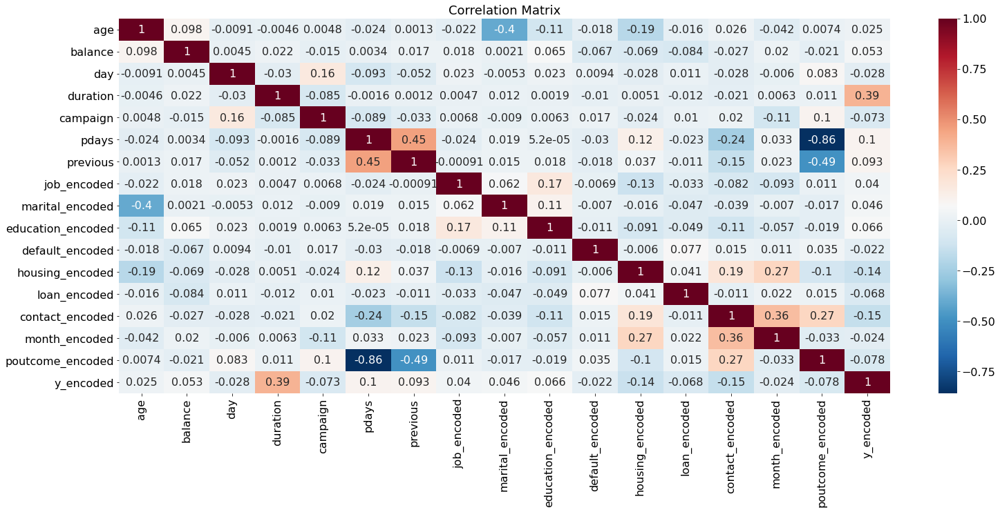
    


```python
encoded_df.columns
```


    Index(['age', 'job', 'marital', 'education', 'default', 'balance', 'housing',
           'loan', 'contact', 'day', 'month', 'duration', 'campaign', 'pdays',
           'previous', 'poutcome', 'y', 'job_encoded', 'marital_encoded',
           'education_encoded', 'default_encoded', 'housing_encoded',
           'loan_encoded', 'contact_encoded', 'month_encoded', 'poutcome_encoded',
           'y_encoded'],
          dtype='object')


```python
encoded_df.drop(object_data, axis=1, inplace=True)
encoded_df.columns
```


    Index(['age', 'balance', 'day', 'duration', 'campaign', 'pdays', 'previous',
           'job_encoded', 'marital_encoded', 'education_encoded',
           'default_encoded', 'housing_encoded', 'loan_encoded', 'contact_encoded',
           'month_encoded', 'poutcome_encoded', 'y_encoded'],
          dtype='object')


```python
#defaut features does not play imp role
print(encoded_df.groupby(['default_encoded']).size())
print(encoded_df.groupby(['y_encoded','default_encoded']).size())
```

    default_encoded
    0    44396
    1      815
    dtype: int64
    y_encoded  default_encoded
    0          0                  39159
               1                    763
    1          0                   5237
               1                     52
    dtype: int64
    


```python
print('10 most frequent values in the column "previous":')
print(encoded_df.groupby(['previous']).size()[:10])
print()
print("Data in previous column compared to the 'y':")
print(encoded_df.groupby(['y_encoded','previous']).size())
```

    10 most frequent values in the column "previous":
    previous
    0    36954
    1     2772
    2     2106
    3     1142
    4      714
    5      459
    6      277
    7      205
    8      129
    9       92
    dtype: int64
    
    Data in previous column compared to the 'y':
    y_encoded  previous
    0          0           33570
               1            2189
               2            1650
               3             848
               4             543
                           ...  
    1          26              1
               29              1
               30              1
               55              1
               58              1
    Length: 66, dtype: int64
    


```python
print(encoded_df.groupby(['pdays']).size())
print(encoded_df.groupby(['y_encoded','pdays']).size())
```

    pdays
    -1      36954
     1         15
     2         37
     3          1
     4          2
            ...  
     838        1
     842        1
     850        1
     854        1
     871        1
    Length: 559, dtype: int64
    y_encoded  pdays
    0          -1       33570
                1           9
                2          35
                3           1
                4           1
                        ...  
    1           804         1
                805         1
                828         1
                842         1
                854         1
    Length: 914, dtype: int64
    


```python
encoded_df.shape
```


    (45211, 17)


```python
encoded_df.drop(['pdays', 'default_encoded', 'previous'], axis=1)
```


<div>
<style scoped>
    .dataframe tbody tr th:only-of-type {
        vertical-align: middle;
    }

    .dataframe tbody tr th {
        vertical-align: top;
    }

    .dataframe thead th {
        text-align: right;
    }
</style>
<table border="1" class="dataframe">
  <thead>
    <tr style="text-align: right;">
      <th></th>
      <th>age</th>
      <th>balance</th>
      <th>day</th>
      <th>duration</th>
      <th>campaign</th>
      <th>job_encoded</th>
      <th>marital_encoded</th>
      <th>education_encoded</th>
      <th>housing_encoded</th>
      <th>loan_encoded</th>
      <th>contact_encoded</th>
      <th>month_encoded</th>
      <th>poutcome_encoded</th>
      <th>y_encoded</th>
    </tr>
  </thead>
  <tbody>
    <tr>
      <th>0</th>
      <td>58</td>
      <td>2143</td>
      <td>5</td>
      <td>261</td>
      <td>1</td>
      <td>4</td>
      <td>1</td>
      <td>2</td>
      <td>1</td>
      <td>0</td>
      <td>2</td>
      <td>8</td>
      <td>3</td>
      <td>0</td>
    </tr>
    <tr>
      <th>1</th>
      <td>44</td>
      <td>29</td>
      <td>5</td>
      <td>151</td>
      <td>1</td>
      <td>9</td>
      <td>2</td>
      <td>1</td>
      <td>1</td>
      <td>0</td>
      <td>2</td>
      <td>8</td>
      <td>3</td>
      <td>0</td>
    </tr>
    <tr>
      <th>2</th>
      <td>33</td>
      <td>2</td>
      <td>5</td>
      <td>76</td>
      <td>1</td>
      <td>2</td>
      <td>1</td>
      <td>1</td>
      <td>1</td>
      <td>1</td>
      <td>2</td>
      <td>8</td>
      <td>3</td>
      <td>0</td>
    </tr>
    <tr>
      <th>3</th>
      <td>47</td>
      <td>1506</td>
      <td>5</td>
      <td>92</td>
      <td>1</td>
      <td>1</td>
      <td>1</td>
      <td>3</td>
      <td>1</td>
      <td>0</td>
      <td>2</td>
      <td>8</td>
      <td>3</td>
      <td>0</td>
    </tr>
    <tr>
      <th>4</th>
      <td>33</td>
      <td>1</td>
      <td>5</td>
      <td>198</td>
      <td>1</td>
      <td>11</td>
      <td>2</td>
      <td>3</td>
      <td>0</td>
      <td>0</td>
      <td>2</td>
      <td>8</td>
      <td>3</td>
      <td>0</td>
    </tr>
    <tr>
      <th>...</th>
      <td>...</td>
      <td>...</td>
      <td>...</td>
      <td>...</td>
      <td>...</td>
      <td>...</td>
      <td>...</td>
      <td>...</td>
      <td>...</td>
      <td>...</td>
      <td>...</td>
      <td>...</td>
      <td>...</td>
      <td>...</td>
    </tr>
    <tr>
      <th>45206</th>
      <td>51</td>
      <td>825</td>
      <td>17</td>
      <td>977</td>
      <td>3</td>
      <td>9</td>
      <td>1</td>
      <td>2</td>
      <td>0</td>
      <td>0</td>
      <td>0</td>
      <td>9</td>
      <td>3</td>
      <td>1</td>
    </tr>
    <tr>
      <th>45207</th>
      <td>71</td>
      <td>1729</td>
      <td>17</td>
      <td>456</td>
      <td>2</td>
      <td>5</td>
      <td>0</td>
      <td>0</td>
      <td>0</td>
      <td>0</td>
      <td>0</td>
      <td>9</td>
      <td>3</td>
      <td>1</td>
    </tr>
    <tr>
      <th>45208</th>
      <td>72</td>
      <td>5715</td>
      <td>17</td>
      <td>1127</td>
      <td>5</td>
      <td>5</td>
      <td>1</td>
      <td>1</td>
      <td>0</td>
      <td>0</td>
      <td>0</td>
      <td>9</td>
      <td>2</td>
      <td>1</td>
    </tr>
    <tr>
      <th>45209</th>
      <td>57</td>
      <td>668</td>
      <td>17</td>
      <td>508</td>
      <td>4</td>
      <td>1</td>
      <td>1</td>
      <td>1</td>
      <td>0</td>
      <td>0</td>
      <td>1</td>
      <td>9</td>
      <td>3</td>
      <td>0</td>
    </tr>
    <tr>
      <th>45210</th>
      <td>37</td>
      <td>2971</td>
      <td>17</td>
      <td>361</td>
      <td>2</td>
      <td>2</td>
      <td>1</td>
      <td>1</td>
      <td>0</td>
      <td>0</td>
      <td>0</td>
      <td>9</td>
      <td>1</td>
      <td>0</td>
    </tr>
  </tbody>
</table>
<p>45211 rows × 14 columns</p>
</div>


```python

```
